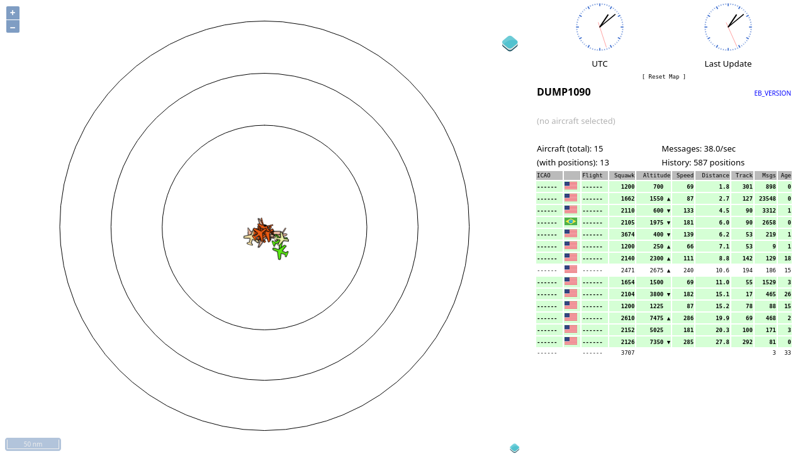
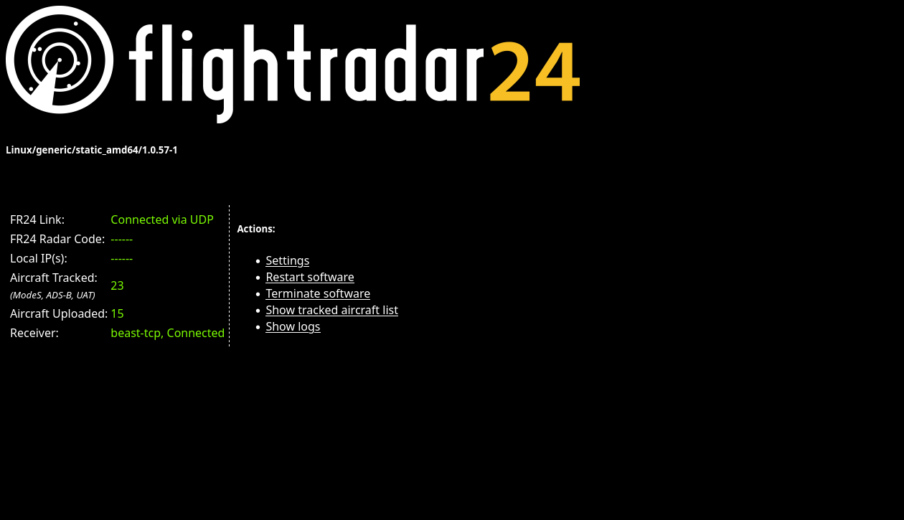
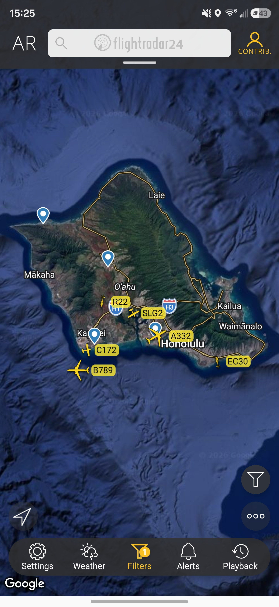

# 🛩️ Home ADS-B Flight Tracker

Track every plane flying over your house — in real time — using a $30 USB dongle, an antenna, and an old laptop. This repo documents my exact setup so you can build your own, even if you've never touched a Raspberry Pi or Linux before.

  

---

## What is this?

Airplanes constantly broadcast their position, altitude, and speed over radio (this is called **ADS-B**). With a cheap USB radio dongle and an antenna, you can *receive* those broadcasts yourself and see every plane in the sky above you — no subscription required.

This setup does three things:
1. **Receives** raw ADS-B signals from aircraft using an SDR (software-defined radio) dongle
2. **Decodes** them into readable flight data with a free piece of software (`dump1090`)
3. **Feeds** that data to public flight-tracking networks (FlightRadar24, ADS-B Exchange, PlaneFinder) — most of which give you a **free upgraded account** in return for feeding them data

---

## 🧰 What you need

| Item | What it does | Approx. Cost |
|---|---|---|
| [RTL-SDR Blog V3 Dongle](https://www.amazon.com/dp/B0BMKZCKTF?tag=stratolabhq-20) | The USB radio receiver — this is the heart of the setup | ~$30 |
| [1090MHz ADS-B Antenna (6dBi) + coax cable](https://www.amazon.com/dp/B0CQN7WXRS?tag=stratolabhq-20) | Picks up aircraft signals; comes with a 10m cable so you can mount it outside/near a window | ~$25 |
| An old laptop or PC | Runs the decoder software 24/7 — doesn't need to be powerful, an 8+ year old laptop works fine | Free (reuse what you have) |

That's it. No Raspberry Pi required (though one works great too, and uses less power if you want something more permanent).

*As an Amazon Associate I earn from qualifying purchases.*

> 💡 **Tip:** Reception range depends almost entirely on antenna placement, not the laptop. A cheap antenna by a window will out-perform an expensive antenna in a closet. Higher and closer to a window with a clear view of the sky = more planes.

---

## 🗺️ How it all fits together

```
   ✈️ Aircraft broadcasting ADS-B (1090MHz)
              │
              ▼
   📡  Antenna (near window / outside)
              │  (coax cable)
              ▼
   📻  RTL-SDR USB Dongle
              │  (USB)
              ▼
   💻  Old Laptop running dump1090
       (decodes raw signals → flight data)
              │
     ┌────────┼──────────────┐
     ▼        ▼              ▼
   FR24   ADS-B Exchange  PlaneFinder
   feed    feed + MLAT      feed
```

Your laptop decodes the signals locally (and shows you a live map at `http://<your-laptop-ip>/dump1090/`), then forwards that data to whichever public networks you choose to feed. Feeding is optional but it's how you unlock free enhanced accounts on these platforms.

---

## 📸 Live screenshots

A couple of examples of what you'll see once everything's running. Identifying details (tail numbers, exact receiver location, radar code) are blanked out for this public repo — your own setup will show real data.

| dump1090 live map | fr24feed status |
|---|---|
|  |  |
| Aircraft currently in range. | FlightRadar24 feeder connection status. |

ADS-B Exchange doesn't have a local status page — the only URL available (`adsbexchange-showurl`) is a public stats endpoint tied to your feeder UUID, not something worth screenshotting.

Once you're feeding FlightRadar24, your receiver also gets used to filter/enhance what you see in their mobile app around your area:



The FlightRadar24 mobile app, filtered to traffic near the receiver.

---

## 🚀 Setup guide

### 1. Flash your OS
Install **Ubuntu 24.04 LTS** (or any recent Debian/Ubuntu) on the old laptop. A minimal/server install is fine — you don't need a desktop environment since you'll run this headless.

### 2. Plug in the hardware
Connect the antenna to the RTL-SDR dongle, then plug the dongle into a USB port on the laptop.

### 3. Install the decoder (dump1090)
```bash
sudo apt update
sudo apt install dump1090-mutability
```
Once installed, check the config at `/etc/default/dump1090-mutability` and set:
```
GAIN="max"
RAW_OUTPUT_PORT="0"
```
Then start it:
```bash
sudo systemctl restart dump1090-mutability
```
Open `http://<your-laptop-ip>/dump1090/` in a browser on your network — you should start seeing planes appear on the map within a minute or two.

### 4. Feed the networks (optional, but recommended)
Each feeder connects to your local dump1090 over port `30005` (Beast format) and forwards data out. See [`scripts/`](scripts) for the install commands for each network:
- [`scripts/install_fr24.sh`](scripts/install_fr24.sh) — FlightRadar24
- [`scripts/install_adsbx.sh`](scripts/install_adsbx.sh) — ADS-B Exchange
- [`scripts/install_planefinder.sh`](scripts/install_planefinder.sh) — PlaneFinder

Each network will give you a **feeder ID** during signup — keep it private (don't post it publicly), it's how they credit your stats and enhanced-account access.

### 5. Verify everything after a reboot
Run [`scripts/startup_check.sh`](scripts/startup_check.sh) any time after a reboot to confirm the dongle, decoder, and all three feeders are alive.

---

## 📁 More reference docs

- [`docs/HARDWARE.md`](docs/HARDWARE.md) — full hardware specs, ports, and antenna placement tips

## 🩹 Troubleshooting

Ran into "device wedged," zombie sockets, or a Python 3.12 `asyncore` error? See [`docs/TROUBLESHOOTING.md`](docs/TROUBLESHOOTING.md) — it covers every issue I hit while building this and the exact fix.

---

## 📊 Check your stats

Once feeding, you can track your own coverage and stats here:
- FlightRadar24: https://www.flightradar24.com/account/feed-stats
- ADS-B Exchange: https://www.adsbexchange.com/api/feeders/
- PlaneFinder: your local status page at `http://<your-laptop-ip>:30053/`, or your account at https://planefinder.net/

---

## 🙋 FAQ

**Do I need a Raspberry Pi?**
No — any old laptop or PC running Linux works. This whole project runs comfortably on hardware from a decade ago.

**Is this legal?**
Yes. Receiving ADS-B is passive listening on public, unencrypted radio broadcasts — no license required (in most countries). You're not transmitting anything.

**Does feeding cost me anything ongoing?**
No, it's free — you're trading a bit of your data/bandwidth for free access to premium tracking features on those platforms.

**How far can I receive?**
With a basic antenna near a window, 50–100+ miles for high-altitude aircraft is common. Line of sight to the horizon is what matters most, not raw antenna price.

---

## License

MIT — see [`LICENSE`](LICENSE). Do whatever you want with this, just don't blame me if a plane doesn't show up. ✈️
